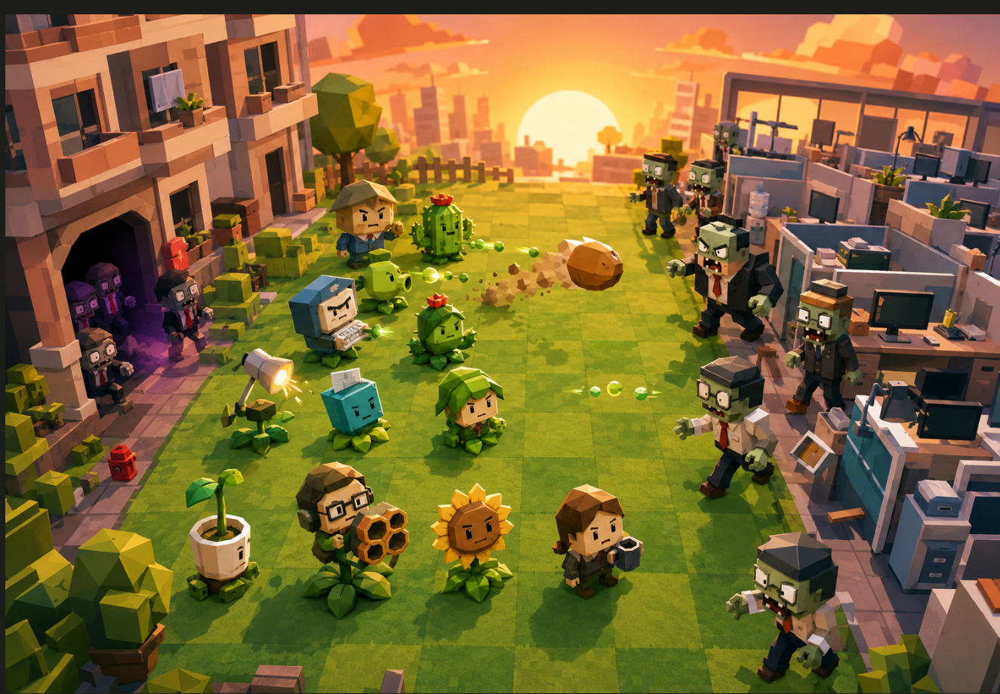
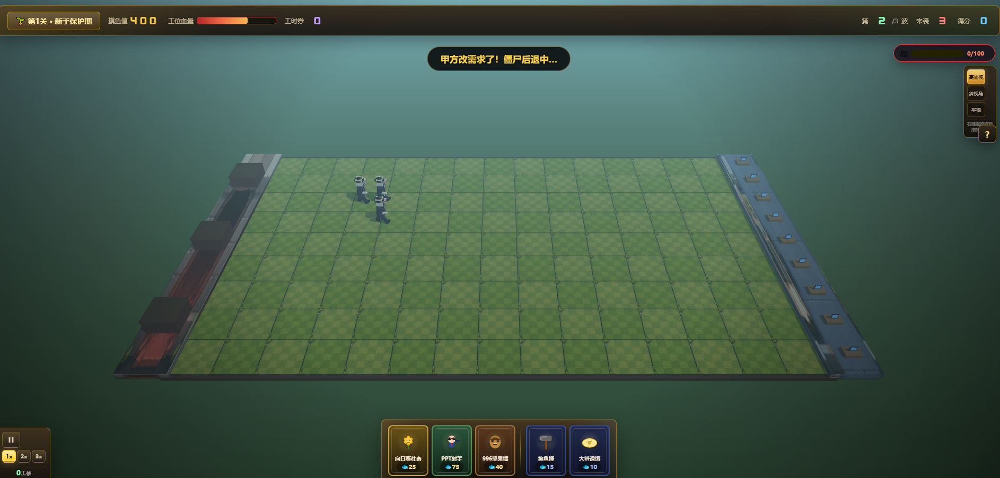
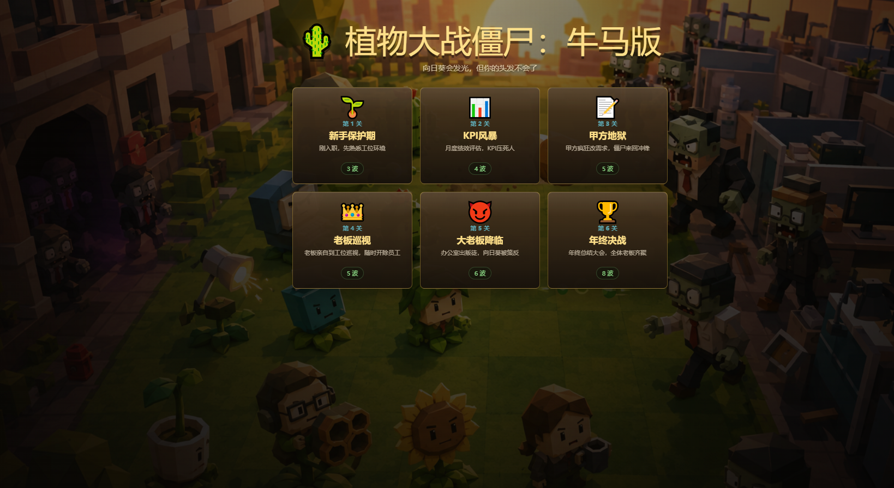

# 植物大战僵尸：牛马版

基于 Three.js + Vite 的 3D 塔防游戏原型。用"打工人荒诞感"重构经典玩法，强调随机事件干扰与生存压力。

## 技术栈

- 渲染：Three.js (r160) + 透视相机俯视 45°
- 构建：Vite + 原生 ES Module
- 交互：Raycaster 鼠标点击地块放置植物 / 敲碎牛头幽灵
- UI：HTML/CSS 叠加层（血条、摸鱼值、卡片栏、事件弹窗）
- 音效：Web Audio API 合成

## 运行

```bash
npm install
npm run dev      # 开发，默认 http://localhost:5173
npm run build    # 生产构建到 dist/
npm run preview  # 预览构建产物
```

## 项目结构

```
/src
  /main.js            入口：场景/相机/渲染器/光照/游戏循环/交互/波次/粒子/音效/胜负
  /systems
    GridSystem.js     5x9 网格生成与 行/列<->Vector3 转换
    ResourceSystem.js 摸鱼值增减与 UI 缓动
    EventSystem.js    牛头指导随机事件池与触发/打断逻辑
  /entities
    Plant.js          植物基类 + 向日葵社畜/PPT豌豆射手/996坚果墙
    Zombie.js         僵尸基类 + 甲方/老板/KPI 三种特殊行为
    Projectile.js     Word 文档弹丸
  /ui
    UIManager.js      顶部状态栏、卡片栏、倒计时、事件弹窗、开始/结束画面
  /utils
    Tween.js          简单补间管理器
```

## 玩法

- 左侧房区生成僵尸，向右进攻右侧工位基地；坚持 5 分钟到下班即胜利。
- 🐟 摸鱼值：初始 50，向日葵社畜每 5 秒产 25。
- 🌻 向日葵社畜（50）：产摸鱼值，抖腿待机。
- 📄 PPT 豌豆射手（100）：发射 Word 文档弹丸，伤害 20。
- 🥜 996 坚果墙（50）：血量 800，受伤出现裂纹与黑眼圈。
- 🔨 摸鱼锤（技能）：点击场上的牛头幽灵可打断干扰（20% 概率反向加班）。
- 🐮 牛头指导：每 15-25 秒随机弹窗，二选一，8 秒不选强制最坑项。
- 失败：工位血量归零，或摸鱼值变为负数（提桶跑路）。

## 方向约定

僵尸从左侧（col<0）生成，向 +x 方向移动，进攻右侧（col≥cols）工位基地；弹丸向 +x 发射。



